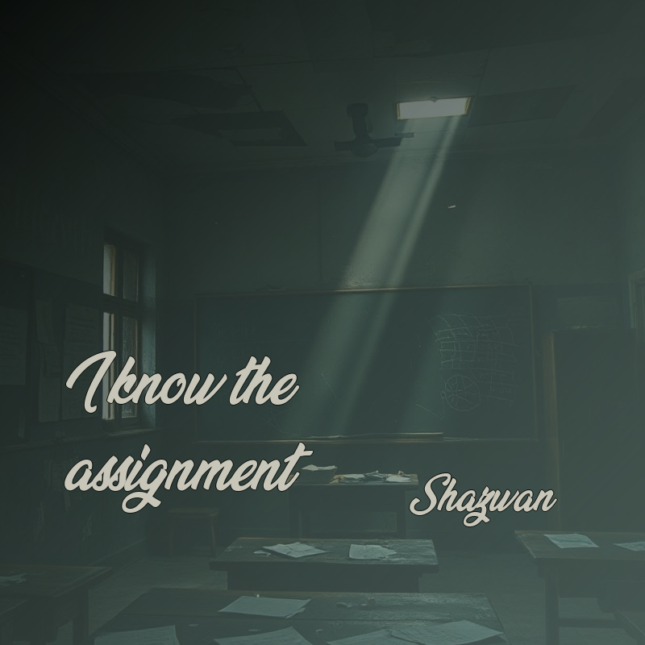

# QuoteCraft: Quote Image Generator

**QuoteCraft** is an easy-to-use application that allows users to generate visually appealing images featuring inspirational, motivational, or thought-provoking quotes. Whether you're creating content for social media or just looking to add a little positivity to your day, QuoteCraft provides you with beautiful designs in seconds.

## Watch the Promo Video

Check out the promo video about **QuoteCraft**:

## Features

- **Random Quote Generation**: Automatically fetches unique quotes from the Forismatic API.
- **Customizable Quote Images**: Choose from different fonts, layouts, and backgrounds to create the perfect quote image.
- **Easy Saving & Sharing**: Save your designs in various formats and easily share them across social media platforms.
- **Fast & Efficient**: Generate and display stunning quote images in a few simple steps.

## Installation

To use **QuoteCraft**, you'll need to set up a few things in your local environment.

### Requirements

- Python 3.x
- Requests Library

### Steps to Install

1. **Clone the repository**  
   Run the following command to clone the repository:  
   `git clone https://github.com/yourusername/quotecraft.git`  
   Navigate into the project directory:  
   `cd quotecraft`

2. **Install dependencies**  
   Make sure you have the required libraries installed:  
   `pip install -r requirements.txt`

3. **Set up the Forismatic API**  
   The app pulls quotes from the Forismatic API. If needed, obtain an API key (though the public endpoint may work without one).

4. **Run the app**  
   Start the application by running the following:  
   `python quote_generator.py`

## How to Use

1. **Generate Quotes**  
   The app will automatically fetch random quotes from the Forismatic API each time it runs. You can also manually add your own quotes if desired.

2. **Customize Your Image**  
   After a quote is fetched, the app will allow you to customize the design, such as adjusting the font, layout, and background.

3. **Save or Share**  
   Once you're satisfied with your design, you can save the image to your device or directly share it on social media platforms.

## Example Usage

Here's an example of how to use **QuoteCraft** to generate a quote image:

1. Import the necessary libraries:  
   `import requests`  
   `from src.imagemanipulator import ImageManipulator`

2. Set the Forismatic API URL and parameters:  
   `url = "http://api.forismatic.com/api/1.0/"`  
   `params = { "lang": "en", "method": "getQuote", "format": "json" }`

3. Request a quote from the API:  
   `response = requests.get(url, params=params)`

4. Process and customize the image:  
   If the response is successful (`response.status_code == requests.codes.ok`), extract the quote and pass it to the `ImageManipulator` class for customization.  
   `data = response.json()`  
   `result = ImageManipulator(prompt=data['quoteText'], seed=4)`  
   `result.process_image()`  
   `result.add_author(author=data['quoteAuthor'])`  
   `result.show_image()`  
   `result.save_image("my_quote_image.jpg")`

5. Handle errors:  
   If the quote request fails, the app will print an error message:  
   `else: print("Error: Unable to fetch quote.")`

## Contributing

We welcome contributions! If you'd like to help improve **QuoteCraft**, feel free to open issues and submit pull requests.

### How to Contribute

1. **Fork the repository.**
2. **Create your branch**:  
   `git checkout -b feature-name`
3. **Commit your changes**:  
   `git commit -am 'Add feature'`
4. **Push to the branch**:  
   `git push origin feature-name`
5. **Create a new Pull Request.**

## License

This project is licensed under the MIT License - see the [LICENSE](LICENSE) file for details.

## Acknowledgments

- **Forismatic API**: Provides an endless supply of inspirational quotes.
- **Pollinations API**: Offers a powerful image generation tool to create stunning, customized visuals for your quotes.
- **Image Manipulation Libraries**: Used for creating and editing quote images.
